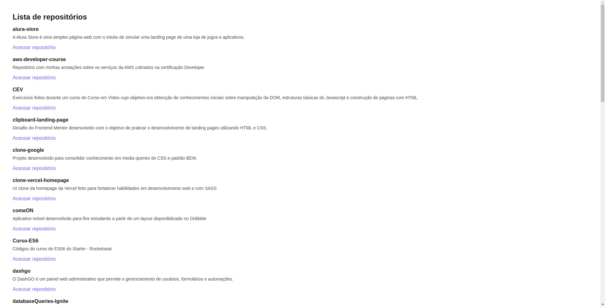

# Github Explorer

<p align="center">
  
  
  
  
</p>

<p align="center">
  <a href="#sobre">Sobre</a> •
  <a href="#github-explorer">Github Explorer</a> •
  <a href="#instalação">Instalação</a> •
  <a href="#tecnologias">Tecnologias</a> •
  <a href="#autor">Autor</a>  
</p>

## Sobre

Projeto desenvolvido durante o bootcamp Ignite da Rocketseat durante a trilha de ReactJS. O projeto em si é bem simples pois foi proposto no primeiro módulo do curso onde a ideia era entender a base da tecnologia e outras ferramentas que compõem seu ecossistema como por exemplo o Babel e Webpack.

## Github Explorer

O Github explorer tem como propósito trazer dados de repositórios de um usuário e lista-los de maneira organizada e centralizada em uma única pagina web.

Ao acessar a aplicação o usuário é direcionado para a tela abaixo, aonde a lista de repositórios estará contida trazendo informações como: nome, descrição e link para visualização do repo diretamente no Github.



Para ilustrar a aplicação em funcionamento, deixo abaixo um GIF aonde navego na aplicação:


## Instalação

Antes de começar, você vai precisar ter instalado em sua máquina as seguintes ferramentas:
[Git](https://git-scm.com), [Node.js](https://nodejs.org/en/).
Além disso é bom ter um editor para trabalhar com o código como [VSCode](https://code.visualstudio.com/).

### 🖥️ Rodando o Front End (Web)

```bash
# Clone este repositório
$ git clone git@github.com:MrRioja/01-github-explorer.git

# Acesse a pasta do projeto no terminal/cmd
$ cd 01-github-explorer

# Instale as dependências
$ npm install
# Caso prefira usar o Yarn execute o comando abaixo
$ yarn

# Execute a aplicação em modo de desenvolvimento
$ npm run dev
# Caso prefira usar o Yarn execute o comando abaixo
$ yarn dev

# O servidor iniciará na porta 8080 - acesse <http://localhost:8080>
```

## Tecnologias


<br><br><br>

## Autor

<div align="center">

<h1>Luiz Rioja</h1>
<strong>Backend Developer</strong>
<br/>
<br/>

<a href="https://linkedin.com/in/luizrioja" target="_blank">

</a>

<a href="https://github.com/mrrioja" target="_blank">

</a>

<a href="mailto:lulyrioja@gmail.com?subject=Fala%20Dev" target="_blank">

</a>

<a href="https://api.whatsapp.com/send?phone=5511933572652" target="_blank">

</a>

<a href="https://join.skype.com/invite/tvBbOq03j5Uu" target="_blank">

</a>

<br/>
<br/>
</div>
